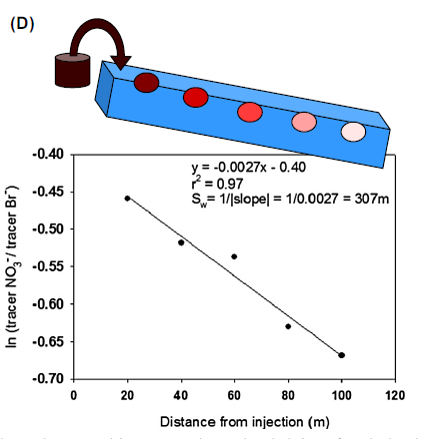

# Calculating Uptake: Uptake Length Calculation (step 3 of 3)

## Study Background

A series of four-hour nutrient enrichment injections were conducted at Como Creek, CO during the summer of 2018 as part of a collaborative NSF funded research project that is evaluating the hydrologic and stoichiometric conditions that maximize N retention. Each series of enrichment injections consisted of the following treatments:

1. nitrogen alone, 
2. nitrogen and carbon, 
3. nitrogen and phosphorus, and 
4. nitrogen, carbon and phosphorus 
* all co-injected with a conservative tracer (chloride). 

Grab samples were taken throughout the experiments to determine background concentrations, plateau concentrations and concentrations down the falling limb of the breakthroughcurve. This analysis will determine the uptake length, average distance traveled by a dissolved nutrient before biotic uptake, for nitrogen for each of the four treatments [@Tank2017].
```{r setup, warning = FALSE, echo = TRUE, message=FALSE}
#Setup
knitr::opts_knit$set(root.dir='./..')
knitr::opts_chunk$set(echo=TRUE)
knitr::opts_chunk$set(warning = FALSE)
knitr::opts_chunk$set(message=FALSE)
library(tidyverse)
library(lubridate)
library(ggplot2)
library(knitr)
library(nlme)
library(ggthemes)
library(ggpubr)
library(gridExtra)
```

## Calculation Overview
Uptake length, Sw, is the average distance traveled by a dissolved nutrient before biotic uptake. It is calculated by fitting a linear model of the natural log of the non-conseravative tracer (nitrate or phosphate) to the conservative tracer (chloride) (i.e. ln([NO3]/[Cl])) by longitudinal distances downstream from the injection site and is defined as the inverse of the linear model slope.
An example of this analysis is displayed below:


[@Tank2017]

## Data Wrangling

* Read in chemistry data (background means and plateau longitudinal) from previous steps. 
```{r}
## Data Read in
chem<- read_csv(('data/in/chem_clean_long.csv'))%>%
  mutate(date=date(datetime))

chem_bg<- read_csv(('data/in/chem_mean_bg.csv'))
```

* Create lookup table for treatments by date of experiments and injection round
```{r}
#create lookup table for injection rounds and treatments
treatment = data.frame(
  date = c(
    "2018-06-26",
    "2018-06-28",
    "2018-06-30",
    "2018-07-02",
    "2018-07-17",
    "2018-07-19",
    "2018-07-21",
    "2018-07-23"
  ),
  treatment = c('N', 'NC', 'NP', 'NCP', 'N', 'NC', 'NP', 'NCP'),
  C = c(0, 1, 0, 1, 0, 1, 0, 1),
  P = c(0, 0, 1, 1, 0, 0, 1, 1)
) %>%
  mutate(treatment= factor(treatment, levels = c('N', 'NC', 'NP', 'NCP')))%>%
  mutate(inj_round = ifelse(
    date %in% c("2018-06-26", "2018-06-28", "2018-06-30", "2018-07-02"),
    1,
    2
  )) %>%
  mutate(date = as.Date(date)) %>%
  mutate(C = as.factor(C)) %>%
  mutate(P = as.factor(P))

treat_sum<-treatment%>%
  select(-P, -C)
kable(treat_sum)
```

* Background correct plateau longitudinal sample concentrations.
* Visually inspect background corrected plateau longitudinal sample concentrations for each day. 
```{r}
#create dataset with bg_mean concentrations
chem_merge<- chem%>%
  left_join(.,chem_bg)

# Subtract bg from raw value
chem_corr<- chem_merge%>%
  mutate(value_corr=value-bg_mean)

#Create function to graph
plotChem_corr <- function (df, site, value = value_corr) {
  date_title<-date(df$datetime[[1]])
    ggplot(df, aes(site,value),group = 1) +
      geom_point(shape = 16, size = 3) +
      geom_line() +
      theme_few() +
      facet_wrap( ~ var, ncol = 1, scale = 'free_y')+
      labs(title = date_title)
}

chem_corr_nest<-chem_corr%>%
  arrange(date)%>%
  group_by(date)%>%
  nest()

corr<-map(chem_corr_nest$data, plotChem_corr, value =chem_corr_nest$data$value_corr )

corr[[1]]
corr[[2]]
corr[[3]]
corr[[4]]
corr[[5]]
corr[[6]]
corr[[7]]
corr[[8]]
```


## Calculate Nitrate Uptake Length

1. Calculate the natural log of the Nitrate to Chloride ratio, ln(N/Cl), for each injection day
2. Create linear model between ln(N/Cl) and sampling site
3. Extract slope from linear model and calculate nitrate uptake length, Sw_N, for each injection day
```{r}
## Create Functions

# for testing
# data= chem_pred$data[[8]]

# to make linear model and save coefficients
uptake_length_n <- function(data=chem_sum$data) {
  lm_fit <- lm(data$ln_n_cl ~ data$site, data)
  co <- coef(lm_fit)
  return(co)
}

# to make linear model and line and confidence interval info
lm_predict_n <- function(data=chem_sum$data){
  lm_fit <- lm(data$ln_n_cl ~ data$site, data)
  predict_lm <- predict(lm_fit, interval = "confidence")
  data_2<-cbind(data, predict_lm)
  return(data_2)
}

```


```{r}
## Calculate N/Cl ratio, make linear model, create summary table

chem_sum <- chem_corr%>%
  select(sample, datetime, site, var, value_corr)%>%
  spread(var, value_corr)%>%
  mutate(n_cl= NO3/Cl)%>%
  mutate(ln_n_cl=log(n_cl))%>%
  filter(!is.na(ln_n_cl))%>%
  select(sample, datetime, site, NO3, Cl, n_cl, ln_n_cl)%>%
  mutate(date=date(datetime))


# # to graph results
# plotChem_sum <- 
#     ggplot(chem_sum, aes(site, n_cl),group = 1) +
#       geom_point(shape = 16, size = 3) +
#       geom_line() +
#       theme_few() +
#       facet_grid(~date, scales="free_y")

# Nest and create linear model extract Sw for each
chem_lm <- chem_sum%>%
  group_by(date)%>%
  nest()%>%
  mutate(lm_model_co = map(data, uptake_length_n))%>%
  mutate(tidy_lm = map(lm_model_co, broom::tidy))%>%
  unnest(tidy_lm)%>%
  spread(names, x)%>%
  rename(intercept= (2))%>%
  rename(slope = (3))%>%
  mutate(sw_N = (1 / -slope))

#display table
kable(chem_lm)

write_csv(chem_lm,"data/out/chem_lm.csv")
```

### Visualize NO3 Data

#### Linear model with sample concentration data by injection date
```{r}
chem_pred <- chem_sum%>%
  left_join(treatment, by='date')%>%
  group_by(date)%>%
  nest()%>%
  mutate(data= map(data, lm_predict_n))%>%
  unnest()

# long graph
g <-  ggplot(chem_pred, aes(x = site, y = ln_n_cl)) +
  geom_point() +
  geom_ribbon(aes(ymin = lwr, ymax = upr, color = NULL), alpha = .15) +
  geom_line(aes(y = fit)) +
  facet_grid( ~ date, scales = "free_y") +
  theme_few() +
  stat_cor(aes(label = paste(..rr.label..,..p.label.., sep = "~`,`~")), 
    label.x = -4, size=3) +
  labs(x = 'Distance downstream', y = 'ln([NO3] / [Cl])')
g

# Stacked by injection round
g1<-chem_pred%>%
  filter(inj_round==1)%>%
  ggplot(., aes(x=site, y=ln_n_cl))+
  geom_point()+
  geom_ribbon( aes(ymin = lwr, ymax = upr, color = NULL), alpha = .15)+
  geom_line( aes(y = fit))+
  facet_grid(~date, scales="free_y")+
  theme_few()+
  stat_cor(aes(label = paste(..rr.label..,..p.label.., sep = "~`,`~")), 
    label.y = -9, size=4) +
  labs(x = 'Distance downstream', y= 'ln([NO3] / [Cl])', title = 'Injection Round 1')

g2<-chem_pred%>%
  filter(inj_round==2)%>%
  ggplot(., aes(x=site, y=ln_n_cl))+
  geom_point()+
  geom_ribbon( aes(ymin = lwr, ymax = upr, color = NULL), alpha = .15)+
  geom_line( aes(y = fit))+
  facet_grid(~date, scales="free_y")+
  theme_few()+
  stat_cor(aes(label = paste(..rr.label..,..p.label.., sep = "~`,`~")), 
    label.y = -4.25, size=4) +
  labs(x = 'Distance downstream', y= 'ln([NO3] / [Cl])', title = 'Injection Round 2')

grid.arrange(g1, g2, ncol=1, nrow =2)
```

#### Boxplot uptake length by treatment
Uptake length for NCP treatment on 07-23-2018 removed due to negative uptake length
```{r}
# remove 07-23-18
chem_sum_n<-chem_lm%>%
  left_join(treatment, by='date')%>%
  filter(date!="2018-07-23")

ggplot(chem_sum_n,aes(x=treatment, y=sw_N))+
  geom_boxplot()+
  theme_few()

ggplot(chem_sum_n, aes(x=treatment, y=sw_N))+
  geom_col()+
  theme_few()+
  facet_grid(inj_round~., scales="free_y")
```

## Calculate Phosphate Uptake Length

1. Calculate the natural log of the Phosphate to Chloride ratio, ln(P/Cl), for each injection day
2. Create linear model between ln(P/Cl) and sampling site
3. Extract slope from linear model and calculate phosphate uptake length, Sw_P, for each injection day
```{r}
## Create Functions

# for testing
# data= chem_pred$data[[8]]

# to make linear model and save coefficients
uptake_length_p <- function(data=chem_sum$data) {
  lm_fit <- lm(data$ln_p_cl ~ data$site, data)
  co <- coef(lm_fit)
  return(co)
}

# to make linear model and line and confidence interval info
lm_predict_p <- function(data=chem_sum$data){
  lm_fit <- lm(data$ln_p_cl ~ data$site, data)
  predict_lm <- predict(lm_fit, interval = "confidence")
  data_2<-cbind(data, predict_lm)
  return(data_2)
}
```


```{r}
## Calculate P/Cl ratio, make linear model, create summary table

chem_sum_p <- chem_corr%>%
  select(sample, datetime, site, var, value_corr)%>%
  spread(var, value_corr)%>%
  mutate(PO4 = as.numeric(ifelse(PO4=='0', 0.0001, PO4)))%>%  
  mutate(p_cl= PO4/Cl)%>%
  mutate(ln_p_cl=log(p_cl))%>%
  filter(!is.na(ln_p_cl))%>%
  select(sample, datetime, site, PO4, Cl, p_cl, ln_p_cl)%>%
  mutate(date=date(datetime))


# Nest and create linear model extract Sw for each
chem_lm_p <- chem_sum_p%>%
  group_by(date)%>%
  nest()%>%
  mutate(lm_model_co = map(data, uptake_length_p))%>%
  mutate(tidy_lm = map(lm_model_co, broom::tidy))%>%
  unnest(tidy_lm)%>%
  spread(names, x)%>%
  rename(intercept= (2))%>%
  rename(slope = (3))%>%
  mutate(sw_P = (1 / -slope))

kable(chem_lm_p)

write_csv(chem_lm_p,"data/out/chem_lm_p.csv")
```

### Visualize PO4 Data

### Linear model with sample concentration data by injection date
```{r}
chem_pred_p <- chem_sum_p%>%
  left_join(treatment, by='date')%>%
  group_by(date)%>%
  nest()%>%
  mutate(data= map(data, lm_predict_p))%>%
  unnest()

# long graph
gp <-  ggplot(chem_pred_p, aes(x = site, y = ln_p_cl)) +
  geom_point() +
  geom_ribbon(aes(ymin = lwr, ymax = upr, color = NULL), alpha = .15) +
  geom_line(aes(y = fit)) +
  facet_grid( ~ date, scales = "free_y") +
  theme_few() +
  stat_cor(aes(label = paste(..rr.label..,..p.label.., sep = "~`,`~")), 
    label.x = -4, size=3) +
  labs(x = 'Distance downstream', y = 'ln([PO4] / [Cl])')
gp

```

### Boxplot uptake length by treatment
Uptake length for NCP treatment on 07-23-2018 removed due to negative uptake length
```{r}
chem_sum_p<-chem_lm_p%>%
  left_join(treatment, by='date')%>%
  filter(date!="2018-07-23")

ggplot(chem_sum_p, aes(x=treatment, y=sw_P))+
  geom_col()+
  theme_few()+
  facet_grid(inj_round~., scales="free_y")
```

```{r, include = FALSE}
## Create an anova to see if there is differences
Model_sw <- aov(sw_N ~ C*P, data = chem_sum_n)
summary(Model_sw)
# plot(Model_sw , main="Un-Transformed SW")
shapiro.test(chem_sum_n$sw_N)

```